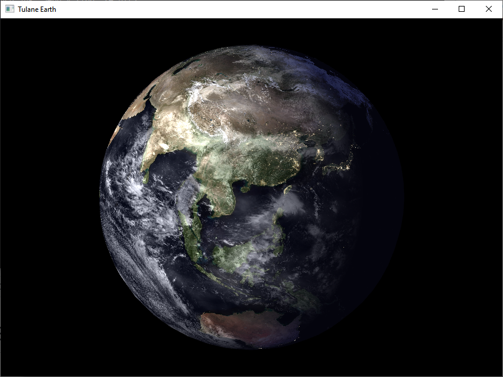
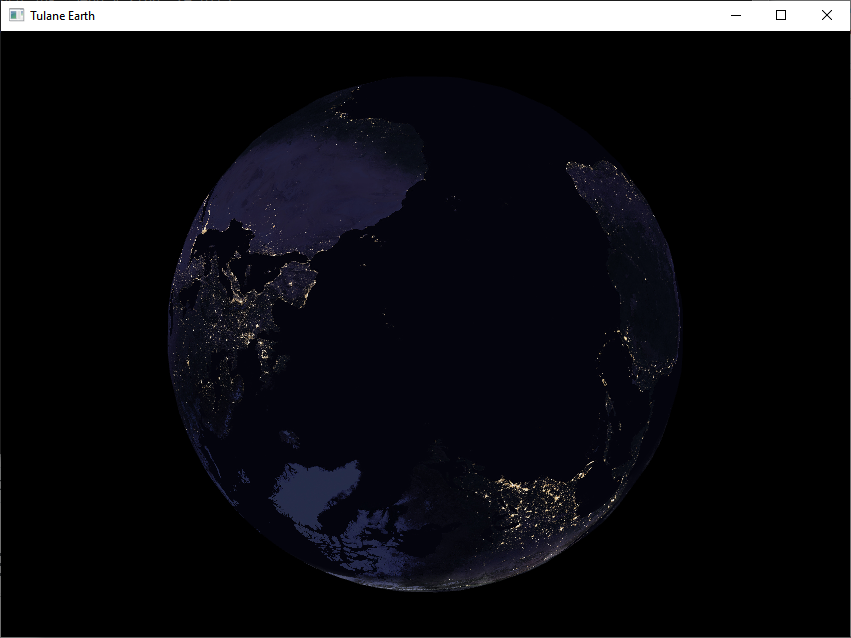

# Blue Globe OpenGL

This project can be successfully compiled using MSVC2017 in release mode using 64bit configuration. All required dependencies are included. 

Original repository link: https://github.com/RJN-2B/Blue-Globe-OpenGL

To rotate view of the globe, use left (or right) mouse click and move mouse to desired position. 
To move the globe, hold 'ALT' while moving the mouse with left mouse click. 
To zoom into the globe, hold 'shift' and left mouse click then move to desired zoom.

